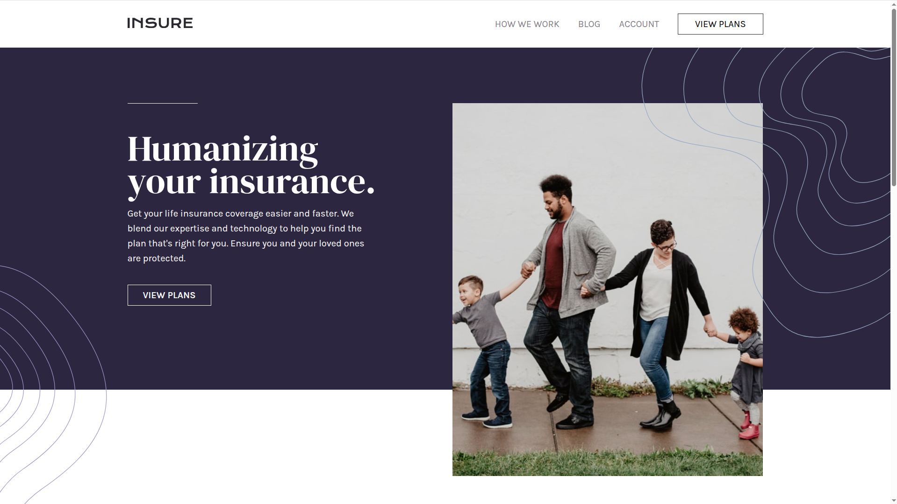
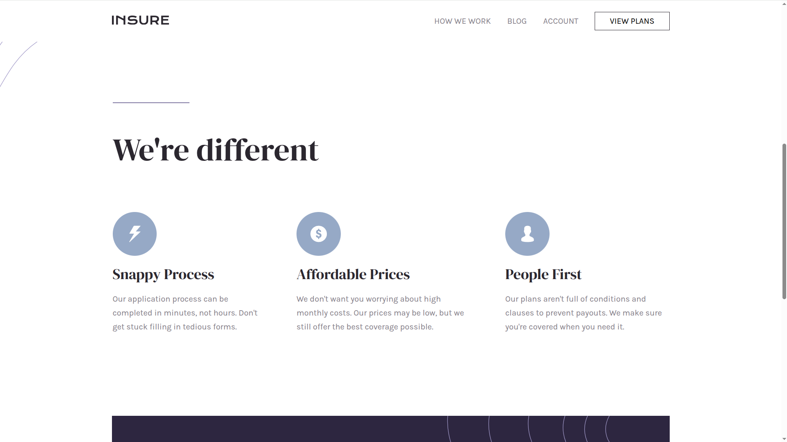
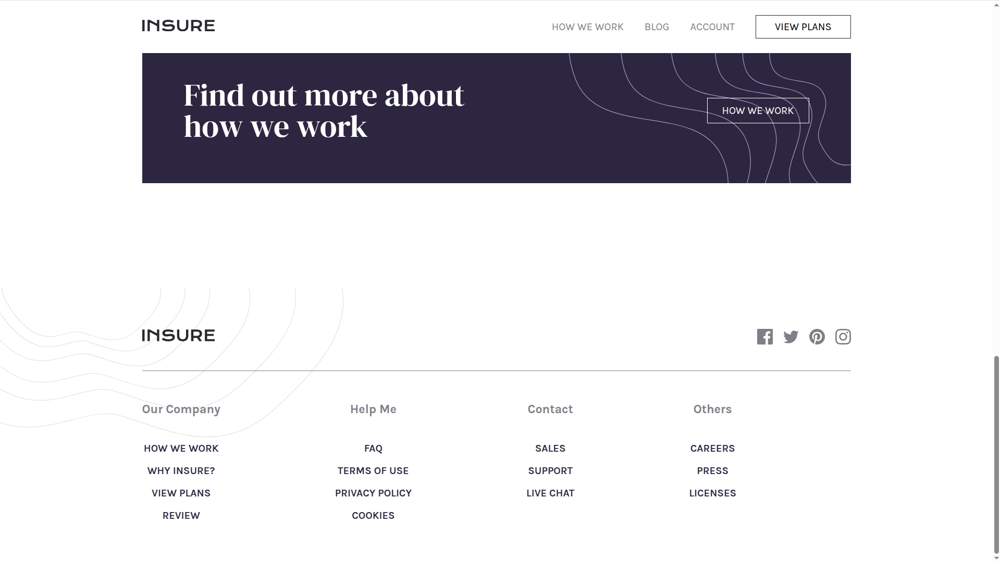
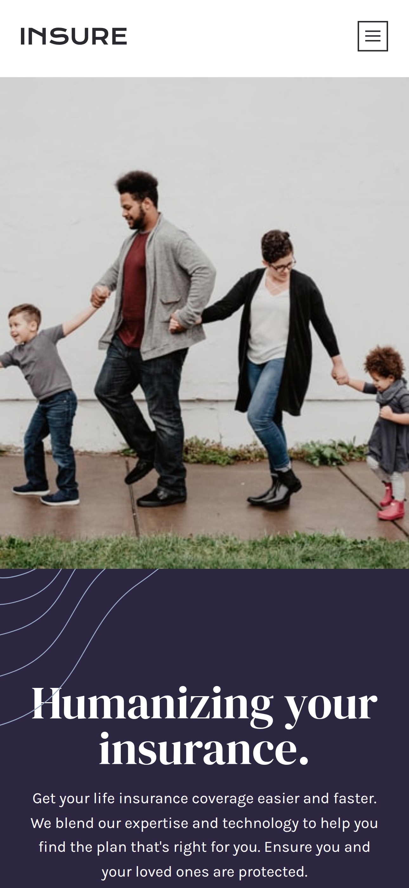
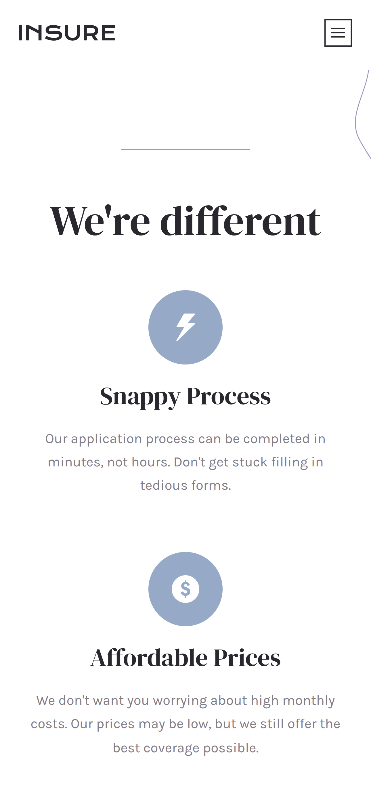
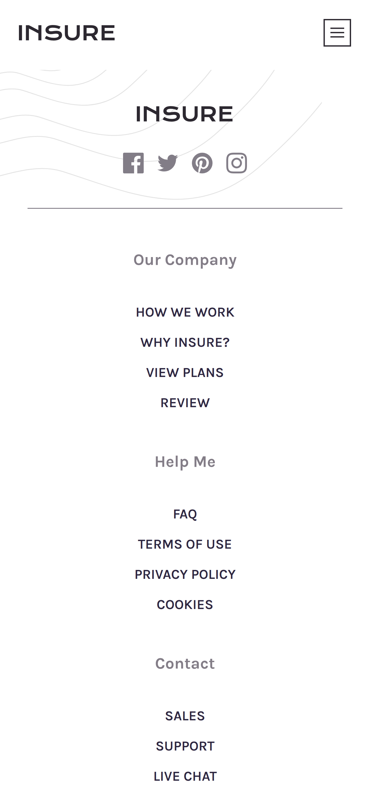
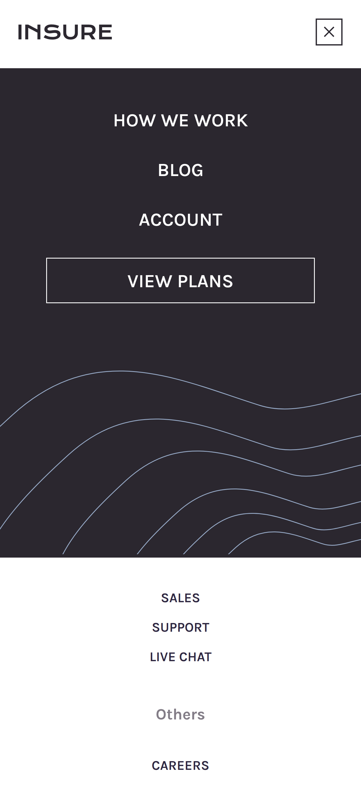

# Insure Landing Page

A landing page for an insurance company, built with **HTML** and **Responsive CSS**. This project was created on [https://frontendmentor.io] and demonstrates core responsive web design skills.

## Technologies Used

- **HTML5** for page structure
- **CSS3** for styling and responsive design

## Live Demo

[View Live Demo](https://kyle-insure-landing-page.netlify.app)

## Screenshots











## Installation & Setup

If you want to run this locally:

1. Clone the repository:
   ```bash
   git clone https://github.com/kylepunta/insure-landing-page.git
